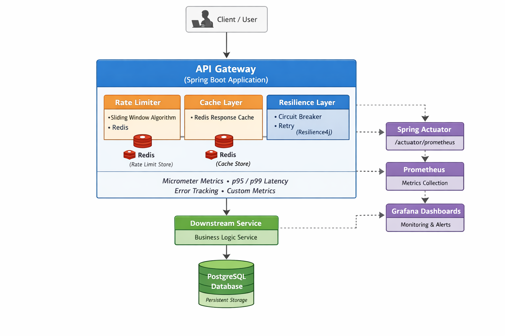
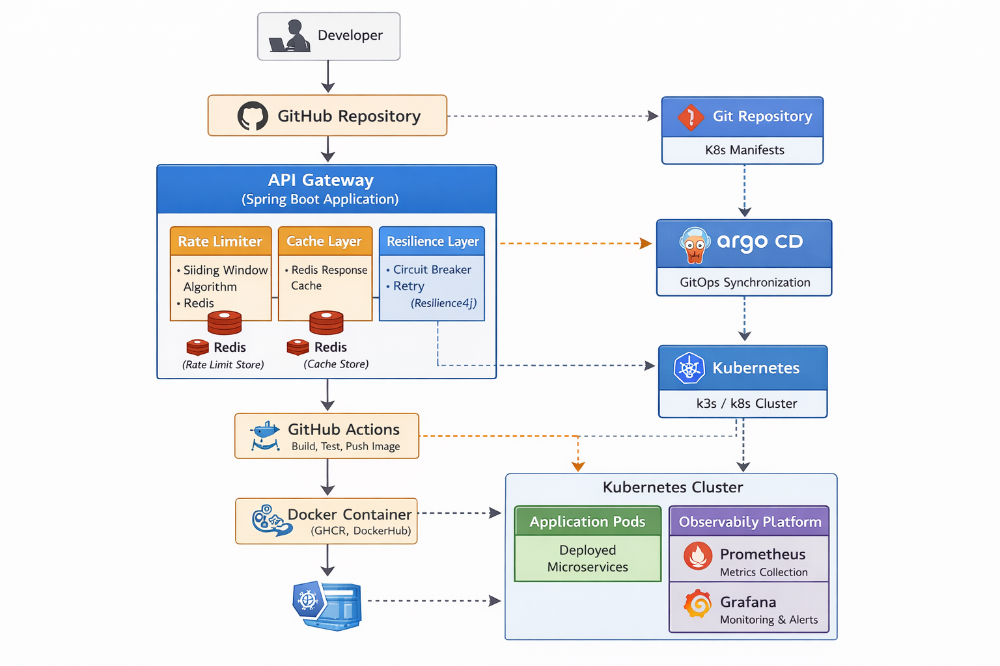
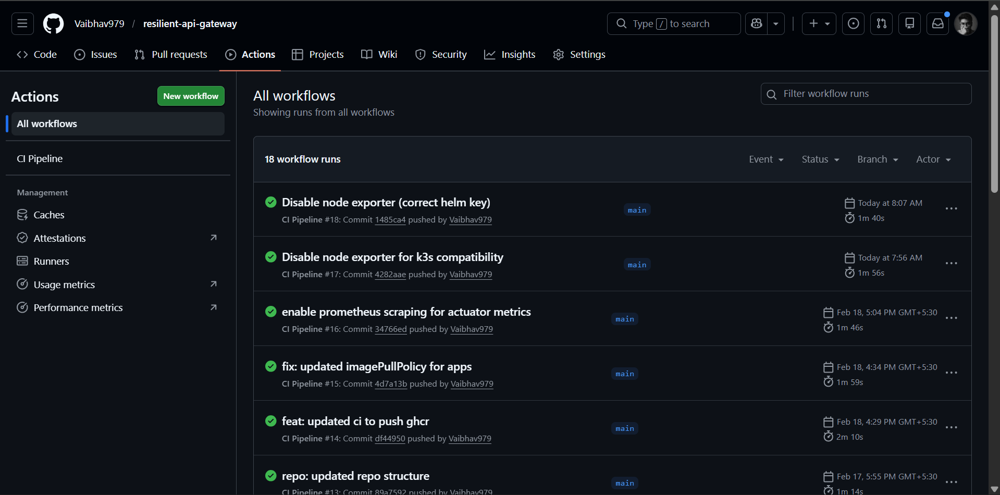
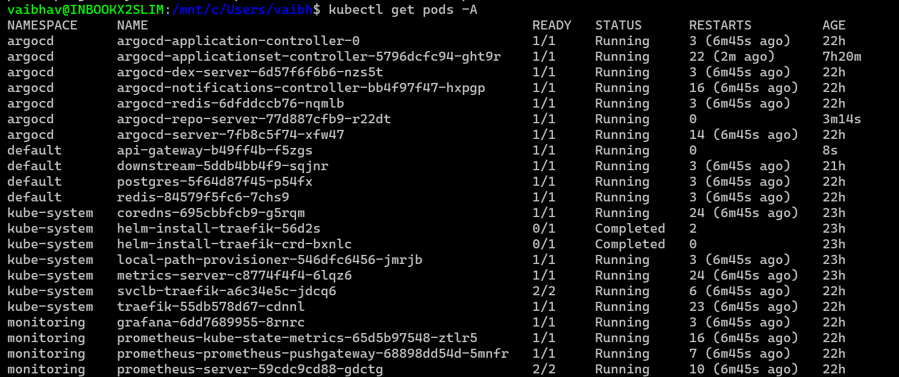
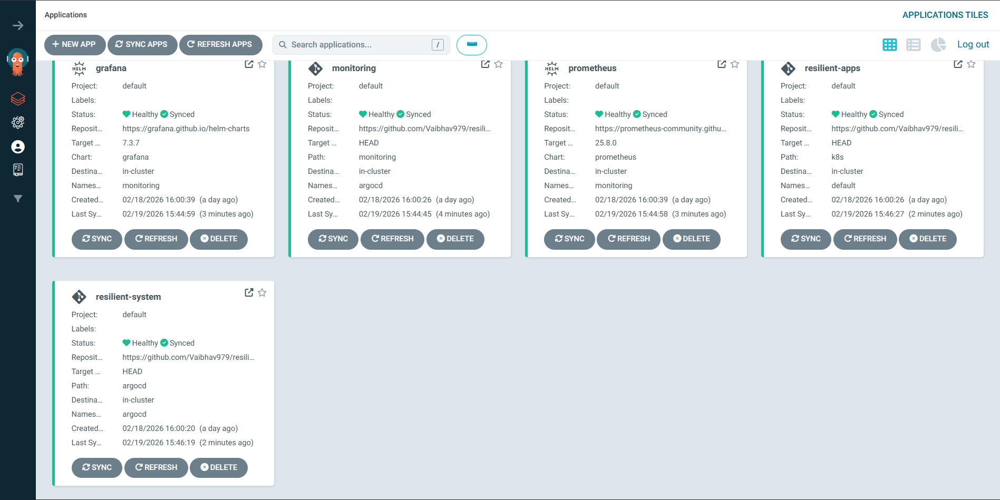
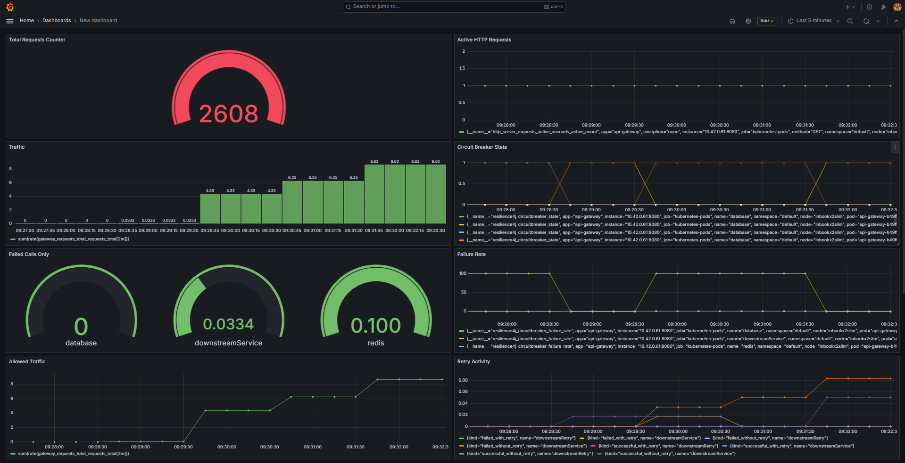
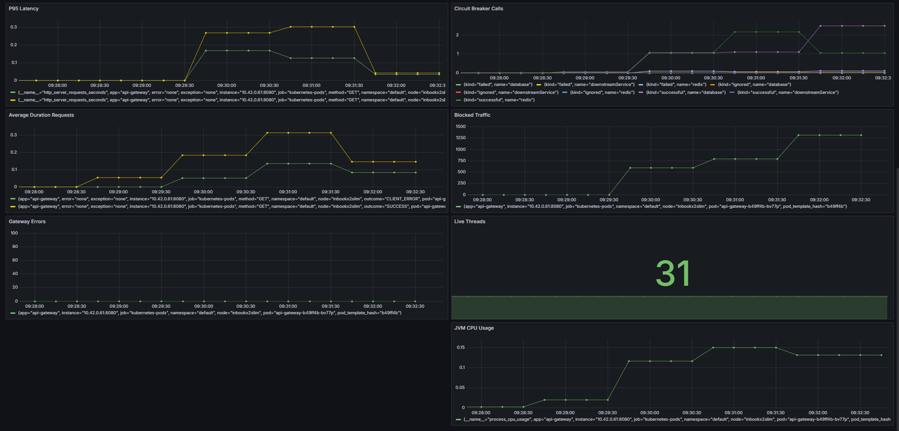

## 📌 Overview

This project demonstrates a production-style resilient backend system built using modern backend, DevOps, and GitOps practices.
The system simulates real-world service behavior under load, failures, and recovery while providing full observability through metrics and dashboards.

The goal was to design and operate a system that is not only functional but also resilient, observable, and deployable using cloud-native workflows.



---

## 🏗 Architecture

Client → Gateway → Redis → PostgreSQL → Downstream Service

API Gateway → Actuator → Prometheus → Grafana

Developer → GitHub
↓
GitHub Actions (CI)
↓
Docker Registry (GHCR)
↓
Git Repo (K8s manifests)
↓
ArgoCD
↓
Kubernetes Cluster (k3s)
↓
Services + Monitoring Stack



---

## ⚙️ Tech Stack

Java, Spring Boot, Redis, PostgreSQL, Docker, Resilience4j, Kubernetes, GitHub Actions, Prometheus, Grafana, ArgoCD

---

## Key Features

### Backend Engineering

- API Gateway architecture (Spring Boot)
- Redis caching layer
- Database caching strategy
- Sliding window rate limiting
- Downstream service communication
- Failure injection for resilience testing

### Resilience Patterns

- Circuit Breaker (Resilience4j)
- Retry mechanisms
- Rate limiting protection
- Graceful degradation

### Observability

- Micrometer metrics exposure
- Custom business metrics
- p90 / p95 / p99 latency tracking
- JVM & system monitoring
- Prometheus metrics scraping
- Grafana real-time dashboards

### DevOps & GitOps

- CI pipeline with automated builds
- Docker image creation & registry push
- Kubernetes deployment (k3s)
- ArgoCD GitOps reconciliation
- Declarative infrastructure management

---

## 🚀 How to Run

### Prerequisites
- Docker & Docker Compose
- Maven 3.9+ (Java 17)
- For K8s: k3s, kubectl, Helm 3+

### 1. Local Development (Docker Compose) - Quick Start
```bash
git clone <your-repo>.git
cd resilient-api-gateway
docker compose up --build -d
```

**Ports**:
| Service | Port |
|---------|------|
| Gateway | 8080 |
| Downstream | 8081 |
| Postgres | 5432 |
| Redis | 6379 |

Test: `curl localhost:8080/api/data`



### 2. End-to-End Kubernetes + ArgoCD + Monitoring

**k3s + ArgoCD Install & Bootstrap** (see full steps in README)





**Grafana Dashboards**:



Full K8s steps: port-forwards for Gateway (30080), Grafana (3000), Prometheus (9090).

---

## What This Project Demonstrates

- End-to-end system lifecycle
- Backend + Platform engineering integration
- Observability-driven development
- Failure-aware system design
- GitOps deployment workflow

## 🛡 Resilience Testing

- Simulated Redis failure
- Simulated DB outage
- Load testing

## Reliability

📄 [docs/reliability.md](docs/reliability.md)

